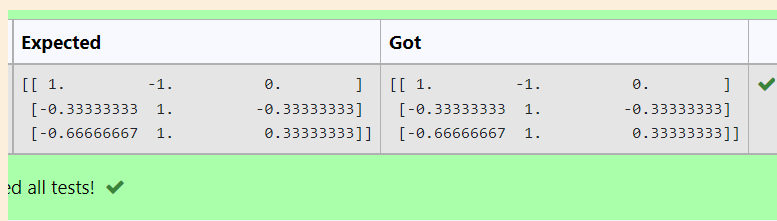

# INVERSE-OF-A-MATRIX
## Aim: to write a program to inverse of a matrix
To write a python program to find the inverse of a matrix
## Equipment’s required:
1. 	Hardware – PCs
2. 	Anaconda – Python 3.7 Installation / Moodle-Code Runner
## Algorithm:
### Step1 : start
### Step 2: import numpy as np
### Step 3: get a input from the user
### Step 4: stop

## Program:
~~~ python
import numpy as np
a = np.array([2,1,1],[1,1,1],[1,-1,2])
sol = np.linalg.inv(a)
print(sol)
~~~

## Output:

## Result:
Thus the inverse of given matrix is successfully solved using python program

